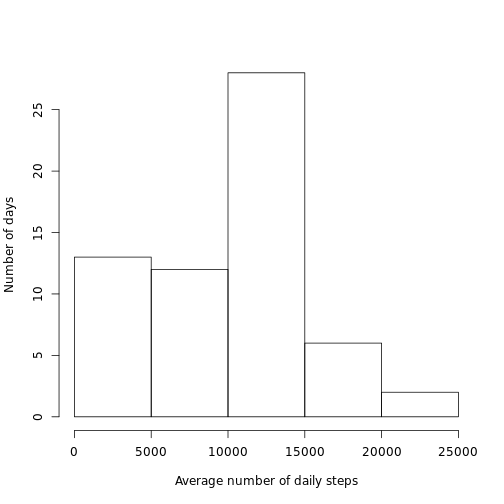
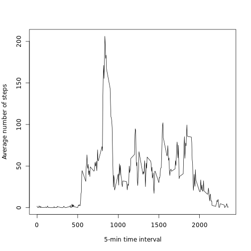
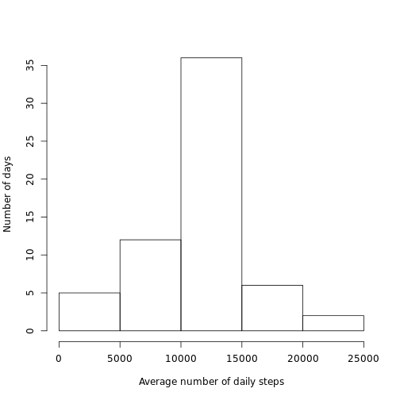
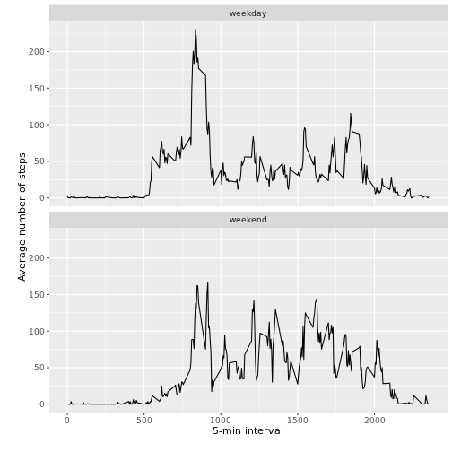

Unzip and read the data file:


```r
unzip("activity.zip")
data <- read.csv("activity.csv", sep = ",", header = TRUE, stringsAsFactors = FALSE)
data$index <- as.numeric(row.names(data))
```

Set the date format to posix:


```r
posixdate <- as.POSIXct(paste(data$date), format="%Y-%m-%d")
data$date <- NULL
data <- cbind(data, posixdate)
names(data)[4] <- "date"
```

Calculate the daily stats:


```r
library(plyr)

Date_stats <- ddply(data, c("date"), summarise,
               Total    = sum(steps, na.rm = TRUE),
               Mean = mean(steps, na.rm = TRUE))
```

Histogram of number of steps per day:


```r
hist(Date_stats$Total, xlab = "Average number of daily steps", ylab="Number of days", main="")
```



Calculate the mean and median number of daily steps:


```r
Mean_steps = round(mean(Date_stats$Total, na.rm = TRUE))
Median_steps = median(Date_stats$Total, na.rm = TRUE)
```

The mean: 9354 and median: 10395 number of daily steps.

Calculate the interval stats:


```r
Interval_stats <- ddply(data, c("interval"), summarise,
               Total    = sum(steps, na.rm = TRUE),
               Mean    = mean(steps, na.rm = TRUE))
```

Plot of the average number of steps per 5-min time interval:


```r
plot(Interval_stats$interval, Interval_stats$Mean,  type="l", ylab = "Average number of steps", xlab = "5-min time interval")
```



Find the 5-min time-interval with the largest number of steps on average:


```r
Max_steps <- max(Interval_stats$Mean, na.rm = FALSE)
Max_interval <- which.max(Interval_stats$Mean)
```

The 5-min interval with the largest number of steps is: 835 with 206 on average. 

Calculate the number of missing values:


```r
count_na <- count(is.na(data$steps))
```

Total number of rows with NA values: 2304.

Replace missing values with the average for the 5-min period:


```r
Mean_interval <- Interval_stats[,c(1,3)]
names(Mean_interval)[2] <- "steps"
data_corr <- merge(data, Mean_interval, by = "interval")
data_corr$steps.x[is.na(data_corr$steps.x)] <- as.numeric(data_corr$steps.y[is.na(data_corr$steps.x)])
data_corr$steps.y <- NULL
names(data_corr)[2] <- "steps"
```

Re-calculate the daily stats after correcting for missing values:


```r
Date_stats_corr <- ddply(data_corr, c("date"), summarise,
               Total    = sum(steps),
               Mean = mean(steps))
```

Histogram of number of steps per day after correcting for missing values:


```r
hist(Date_stats_corr$Total, xlab = "Average number of daily steps", ylab="Number of days", main="")
```



Calculate the mean and median number of daily steps after correcting for missing values:


```r
Mean_steps_corr =round(mean(Date_stats_corr$Total))
Median_steps_corr = round(median(Date_stats_corr$Total))
```
The mean: 10766 and median: 10766 number of daily steps after correcting for missing values.

Find the day of the week using the date:


```r
day <- data.frame(weekdays(data_corr$date))
names(day)[1] <- "day"
data_corr <- cbind(data_corr, day)
```

Create a new factor with two levels (weekend or weekday):


```r
weekend <- subset(data_corr, day == "Saturday" | day == "Sunday")
weekend <- mutate(weekend, daytype = "weekend")
weekday <- subset(data_corr, day != "Saturday" & day != "Sunday")
weekday <- mutate(weekday, daytype = "weekday")
data_corr <- rbind(weekday, weekend)
data_corr$daytype <- as.factor(data_corr$daytype)
```

Calculate the interval stats on weekdays compared to weekends using the corrected data:


```r
Interval_stats_corr <- ddply(data_corr, c("interval", "daytype"), summarise,
               Total    = sum(steps, na.rm = TRUE),
               Mean    = mean(steps, na.rm = TRUE))
```

Panel plot of the average number of steps per 5-min time interval on weekdays compared to weekends:


```r
library(ggplot2)

ggplot(data=Interval_stats_corr, aes(interval, Mean)) +
    geom_line() + 
    facet_wrap(~daytype, nrow=2) +
    xlab("5-min interval\n") +
    ylab("\nAverage number of steps")
```


